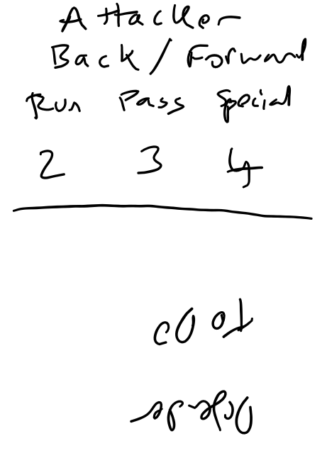

# Rugby Card Game Rules

### Components

* 1 (2?) deck of play cards
* 1 deck of skill cards
* state tracking cards

#### Anatomy of Play Card
Each card consists of a number of sections. There are two types attack and defense.

Attack Play Card:
* (??? Some form of previous players next players system)
* The players involved
* Skill being used
* Starting Skill value
* Card draw provided
* Preferred following suit
* Success benefit table

Defense Play Card:
* (??? Some form of previous players next players system)
* The players involved
* Skill being used
* Starting Skill value
* Card draw provided
* Preferred following suit
* Success benefit table

#### Anatomy of Skill Card

Each card is in two halves. Attack and Defense.

Attack half consists of:
* Type: one of Pass, Run, Special (better name ???)
* Subtype: Strength or Agility
* Value: numbers 1 - X
* (??? A symbol that repsents the risk of a knock on or a penalty)

Attack Examples:
* Long Pass, Pop Pass
* Weave run, Crash ball
* Pick & Go, Kick

Defense half consists of:
* Type: Press, Drift, Special
* Subtype: Strength or Agility
* Value: numbers 1 - X
* (??? A symbol that repsents the risk of a knock on or a penalty)

Defense Examples:
* Blitz, Low & High ???
* Push, Pillars 1,2,3
* Swiper, ???

#### State Tracking Cards

* 1 score and field position tracking card
* 1 current phase & territory change tracking card
* 1 time remaining tracking card

### Setup 

### Play

Phases of Play
* Open play
* lineouts
* scrums
* penalties
* free kicks ???
* kick offs

### Winning
