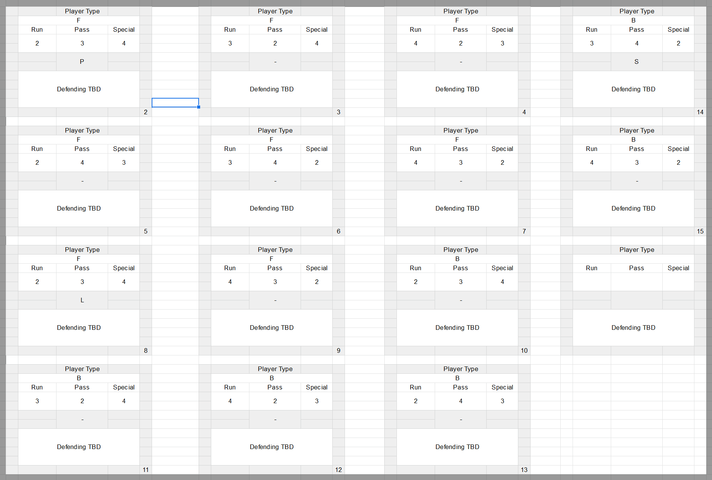
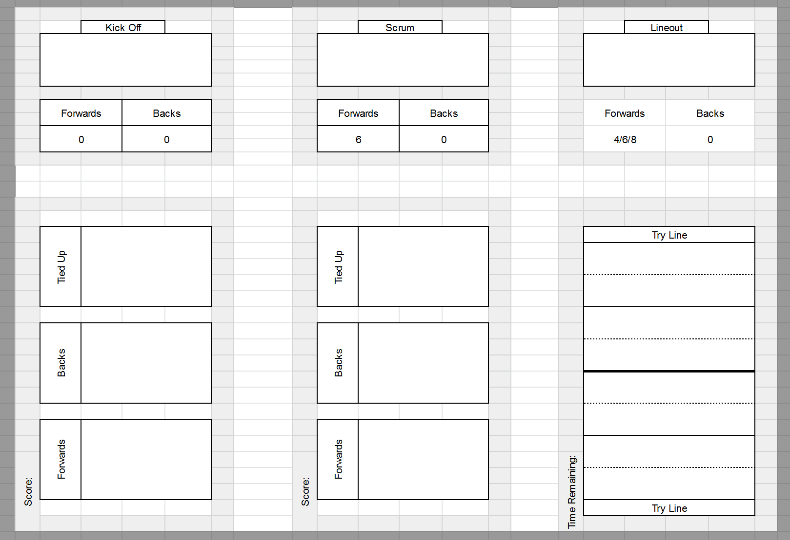

# Rugby Card Game Rules

### Components

* 1 deck of Play cards
 * 4 sets of 6 = 24
* 2 decks of Skill cards, forwards and backs
 * 4 sets of 8 forwards = 32
 * 4 sets of 6 backs = 24
* Assorted State tracking cards
 * 1 time remaining and position cards
 * 2 player cards
 * 3 set piece cards
 
 80 game cards
 6 stats cards

### Iconography

* Cards: Skill, Play, Stats, Set Piece
* Skills: Run, Pass, Special (R, P, S)
* Set Pieces: Kickoff, Lineout, Knock on (Ki, L, Kn)
* Others: Penalty, Ruck (P, R)

#### Anatomy of Play Card
Each card consists of a number of sections. 

Attack Play Card:
* The No. of players involved and the type (Forwards, Backs or a Mix)
* Skill being used
* Result table

#### Anatomy of Skill Card

There are 2 decks, one for forwards and one for backs

Each card is in two halves. Attack and Defense.

Attack half consists of:
* Player: Back or Forward
* Type: Pass, Run or Special 
* Value: numbers 2 - 4

Attack Examples:
* Long Pass, Pop Pass
* Weave run, Crash ball
* Pick & Go, Kick

Defense half to be determined, for now they will be the same as attack.

#### State Tracking Cards

* 2 player boards, with score and area for back, forward and tied up deck.
* 1 field board, with time remaining and field position.
* 3 Set Piece cards, Kick offs, Line outs and Scrums. They are used to restart play in certain situations.

#### Anatomy of a Set Piece Card

These cards outline the starting position of the teams at a Set Piece.

Each side must do the following:
* Scrum - 6/8 Forwards are put in the tied up pile
* Lineout - 4/6/8 Forwards are put in the tied up pile
* Kickoff/Reset - No players are put in the tied up pile.

### Game Setup 

Shuffle the Play and Skills deck.

Layout the tracking cards and place counters on the starting positions.

Determine who will be the first attacking player.

Setup a Kickoff Set Piece on the half way line.

### Set Piece Setup

There are 3 types of Set Pieces; Reset/Kickoff, Lineout & Scrum.

At the start of each set piece, create each teams decks. 
* Draw 6 backs cards from the backs skills deck.
* Draw 8 forwards cards from the forwards skills deck. 
* Wihtout looking at them, place the appropriate number of skill cards listed on the Set Piece card in the tied up deck.
* Draw the number of Play cards listed

### Play

Playing is made of a collection of phases between set pieces. In each phase the attacker chooses a play card, then both players use their skill cards to determine the level of success or failure of the play. This pattern is repeated until either the attacker scores, possesion changes hands, or a new set piece occurs.

_Steps of a Play_
* Attacker chooses a play card that they have the player to do.
 * If the attacker doesn't have enough players, they immediately give away a penalty.
* Attacker tells the defender how many players and what type they are.
* Defender chooses skill cards of the matching type and number.
 * If the defender can't play enough cards they must play what they have.
* Reveal the play card and each sides skill cards.
* The defender can draw one random card from their remaining cards.
* If they do the attacker can do also once.
* Resolve the play card.
* If the play brings the attack over the try line and possession has not changed, a try is scored and the team awarded 7 points.
* Return the number of skill cards listed on the Play card,based on what is depicted take from the top or bottom of the tied up deck.
* Place the played Skill cards in the tied up pile.
* Attacker draws a new Play card.
* Attacker continues playing Play cards until there is a score or change in possession.

_Resolve Play Card_

Resolve the Play card, by comparing the skill on the Play card against the matching skill on the played Skill cards. Skill cards that don't match the player type of play card are worth half.

* Sum the value of the matching skill for attackers and defenders.
  * Half if the player type doesn't match.
* Check against the play cards result table
  * Move the ball marker forward or backwards on the territory tracker the stated amount.
  * A big win / big loss is when the amount is equal or greater then the number of cards that side played.
  * If a set piece icon appears, then the play ends and a new play begins with defender now the attacker. Start with the shown set piece.
  * Resolve if a penalty, knock on or ball in touch has occurred.

_Penalty, knock on or ball in touch_

When trying to beat a defender, smashing an attacker, or pull off a complex move, sometimes things go too far. The player can knock the ball on, or give away a penalty. 

When you see the (P) symbol there is a chance that possession will switch with either a knock on, penalty or the ball going into touch. 

For each symbol draw from the shared skill card deck that number of cards.
The symbols are resolved in this order:
1. Penalty
2. Knock On
3. Ball in Touch
The highest one present is what happens.

Possession always switches to whoever was on the lossing side of the skill check. So too strong an attack can lead to the defender wining the ball for example.
* For knock on, play restarts with a scrum set piece.
* For ball into touch, play restarts with a line out set piece.
* For a penalty, the now attacking player can choose:
  * A Scrum Set Piece in the current location
  * A Lineout Set piece 2 places forward
  * A shot at goals.

_Shot at Goals_

The attacker draws two Skill cards and sums the Special values. The target to beat is 3 + the distance from the try line.

Success giving the attacking team 3 points. Play restarts with a Kickoff on the halfway line.
Failure leads to a Kickoff on the defenders 22 line.

#### Tracking Time
Each half will consist of 30 phases.The half ends after the next set piece that doesnt come from a penalty.
The next half restarts with a kick off on the half way line with the opposite team that started the game kicking off.

### Winning

The game ends after 2 halfs are played, with the team with the most points winning.
